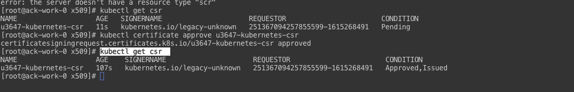

# 问题说明
 在使用阿里云过程中，如果需要访问阿里云ACK，则需要通过RAM用户进行相关的授权认证。但是ACK 完全兼容开源K8s,因此，可以考虑使用纯开源的方式进行管理相关的用户请求权限。目前有按照kubeconfig 的认证方式有
  - token
  - x509client ca
token 认证相对简单，但是授权无状态，认证的时效等都不好控制。目前比较推荐的做法是使用 X509客户端认证的方式。下面主要介绍如何基于X509客户端认证


# x509 客户端认证
 - 创建请求签名(只有7天有效期):注意 CN代表用户名，O代表组织，或者业务系统分类均可
   ```bash
     openssl req  -new -days 7 -newkey rsa:4096 -nodes -keyout u3647.key -out u3647.csr -subj "/CN=u3647/O=remes"
   ```
 - 生成后有 `u3647.csr` 和 `u3647.key`  文件
 - 把 `u3647.csr` 进行base64编码
 - 编码完成，使用kubectl 创建 CSR请求
    ```bash
    cat << EOF >> u3647-csr.yaml
    apiVersion: certificates.k8s.io/v1beta1
    kind: CertificateSigningRequest
    metadata:
      name: u3647-kubernetes-csr
    spec:
      groups:
      - system:authenticated
      request: $cat xxx.csr | base64 | tr -d "\n">
      usages:
      - client auth
    EOF
    ```
  - 执行：
    ```bash
    kubectl apply -f u3647-csr.yaml
    ```
  - 批准csr
    ```bash
    kubectl get csr
    kubectl certificate approve u3647-kubernetes-csr
    kubectl get csr
    ```
  - 执行效果如图
    

  - 获取 pem/crt文件，个人习惯使用pem文件
    ```bash
    kubectl get csr u3647-kubernetes-csr -o jsonpath='{.status.certificate}' | base64 --decode > u3647.pem
    ```
  - 获取集群ca证书，正常情况在node 节点 的 `/etc/kubernetes/pki/` 目录下。有这些文件，就可以生成`kubeconfig` 文件。

# 生成客户端证书
  ```bash
  kubectl config set-cluster kube-dev \
  --certificate-authority=ca.pem \
  --embed-certs=true \
  --server=https://10.9.0.154:6443 \
  --kubeconfig=u3647.kubeconfig
  ```
  ```bash
  kubectl config set-credentials u3647 \
  --client-certificate=u3647.pem \
  --client-key=u3647.key \
  --embed-certs=true \
  --kubeconfig=u3647.kubeconfig
  ```
  ```bash
  kubectl config set-context kube-dev \
  --cluster=kube-dev \
  --user=u3647 \
  --namespace=remes \
  --kubeconfig=u3647.kubeconfig
  ```
  ```bash
  kubectl config get-contexts  --kubeconfig=u3647.kubeconfig
  ```
至此kubeconfig 文件已经生成，可以使用该证书访问集群，但是却没有任何权限，因此，需要配置相关的`role`,和`roleBinding`。这里具体参考K8S `RBAC`权限认证。

# 绑定权限
  ```bash
  cat << EOF > role.yaml
  apiVersion: rbac.authorization.k8s.io/v1
  kind: Role
  metadata:
    namespace: kube-system
    name: pod-reader
  rules:
  - apiGroups: [""]
    resources: ["pods"]
    verbs: ["get", "watch", "list"]
  EOF
  ```
  ```bash
  cat << EOF > roleBinding.yaml
  apiVersion: rbac.authorization.k8s.io/v1
  kind: RoleBinding
  metadata:
    name: read-pods
    namespace: kube-system
  subjects:
  - kind: User
    name: u3647
    apiGroup: rbac.authorization.k8s.io
  roleRef:
    kind: Role
    name: pod-reader
    apiGroup: rbac.authorization.k8s.io
  EOF
  ```
权限绑定完成，就具有 `kube-system` 租户下，查看 `pod` 的权限


